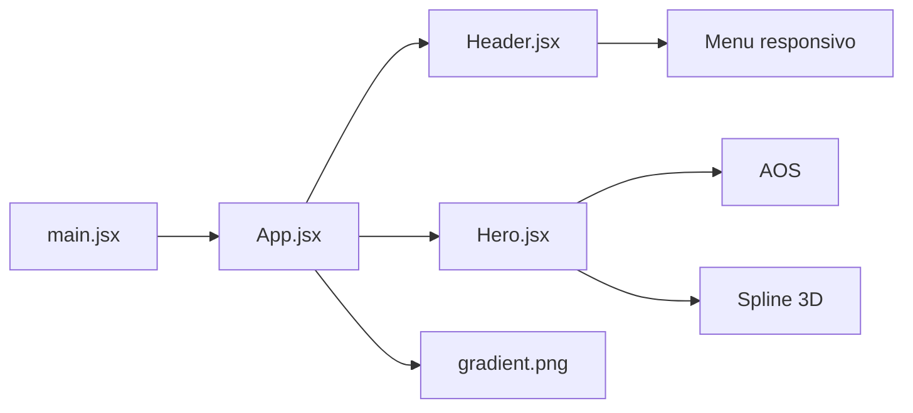

# MCODE

<p align="center">
	<strong>Email infrastructure for developers</strong><br />
	Uma landing page imersiva para apresentar uma plataforma de envio de emails transacionais e de marketing em escala.
</p>

<p align="center">
	<a href="#comece-aqui">Comece aqui</a> ·
	<a href="#como-funciona">Como funciona</a> ·
	<a href="#estrutura">Estrutura</a> ·
	<a href="#scripts">Scripts</a>
</p>

<p align="center">
	
</p>

<p align="center">
	
	
	
</p>

## Sobre o projeto

MCODE e uma experiencia de primeira tela com linguagem visual escura, tipografia ampla, brilho alaranjado, entrada de elementos por scroll e um personagem 3D interativo. O objetivo atual e comunicar rapidamente a proposta do produto e conduzir o visitante para documentacao ou inicio da plataforma.

> **Estado atual:** prototipo de landing page. Os links de navegacao e os botoes de acao ainda usam `#` como destino e devem ser conectados ao produto quando as rotas estiverem definidas.

## Como funciona



O fluxo da aplicacao e deliberadamente simples:

1. `main.jsx` monta o React no elemento raiz da pagina.
2. `App.jsx` inicializa o AOS e compoe o `Header` com o `Hero`.
3. `Header.jsx` alterna o menu mobile e exibe a navegacao principal.
4. `Hero.jsx` apresenta a mensagem principal, CTAs e a cena 3D carregada do Spline.
5. `index.css` importa o Tailwind CSS e define a base escura da pagina.

## Comece aqui

### Requisitos

- Node.js 20 ou superior
- npm 10 ou superior
- Conexao com a internet para carregar a cena 3D hospedada no Spline

### Instalacao

```bash
git clone <url-do-repositorio>
cd mcodewebsite
npm install
```

### Desenvolvimento

```bash
npm run dev
```

Abra a URL exibida pelo Vite, normalmente `http://localhost:5173`.

### Validacao local

Antes de publicar, rode a verificacao de qualidade e a build de producao:

```bash
npm run lint
npm run build
npm run preview
```

O comando `preview` serve o conteudo gerado em `dist/` para uma revisao final semelhante a producao.

## Scripts

| Comando | Funcao |
| --- | --- |
| `npm run dev` | Inicia o servidor de desenvolvimento com HMR. |
| `npm run lint` | Executa o ESLint nos arquivos JavaScript e JSX. |
| `npm run build` | Gera os arquivos otimizados em `dist/`. |
| `npm run preview` | Abre localmente a build de producao. |

## Stack e decisoes

| Tecnologia | Papel no projeto |
| --- | --- |
| React 19 | Componentizacao e composicao da interface. |
| Vite 8 | Desenvolvimento local e empacotamento rapido. |
| Tailwind CSS 4 | Estilizacao responsiva direto nos componentes. |
| AOS | Animacoes de entrada acionadas pelo scroll. |
| Spline | Cena 3D interativa do hero. |
| Boxicons | Icones da navegacao e dos botoes. |

O Tailwind e conectado pelo plugin `@tailwindcss/vite` em `vite.config.js`; por isso, nao ha um arquivo separado de configuracao do Tailwind neste projeto.

## Estrutura

```text
mcodewebsite/
├── public/
│   ├── favicon.svg       # Favicon
│   ├── gradient.png      # Textura visual do fundo
│   └── icons.svg         # Recursos SVG publicos
├── src/
│   ├── assets/            # Imagens importadas pelos componentes
│   ├── components/
│   │   ├── Header.jsx     # Navegacao desktop e menu mobile
│   │   └── Hero.jsx       # Mensagem principal e cena 3D
│   ├── App.jsx            # Composicao da tela e inicializacao do AOS
│   ├── index.css          # Tailwind e estilos base
│   └── main.jsx           # Ponto de entrada do React
├── index.html
├── package.json
└── vite.config.js
```

## Onde editar

- **Marca e navegacao:** `src/components/Header.jsx`
- **Titulo, descricao e CTAs:** `src/components/Hero.jsx`
- **Cena 3D:** altere a prop `scene` do componente `Spline` em `Hero.jsx`
- **Fundo e estilo global:** `src/index.css` e as classes Tailwind em `App.jsx`
- **Imagens estaticas acessiveis por URL:** `public/`

## Publicacao

O projeto gera uma SPA estatica. Qualquer servico que hospede arquivos estaticos pode servir a pasta `dist/`:

```bash
npm run build
```

Em hospedagens com roteamento do lado do cliente, configure o fallback de rotas para `index.html`. Como a cena do Spline e remota, a experiencia 3D depende de conectividade no navegador do visitante.

## Proximos passos naturais

- Conectar `Documentation`, `Get Started` e `SIGNIN` a destinos reais.
- Corrigir e revisar o texto de produto antes da publicacao.
- Adicionar secoes de recursos, casos de uso e rodape.
- Substituir os placeholders de navegacao por rotas ou URLs configuraveis.

<p align="center">
	Feito para transformar uma primeira visita em um proximo passo claro.
</p>
# React + Vite

This template provides a minimal setup to get React working in Vite with HMR and some ESLint rules.

Currently, two official plugins are available:

- [@vitejs/plugin-react](https://github.com/vitejs/vite-plugin-react/blob/main/packages/plugin-react) uses [Oxc](https://oxc.rs)
- [@vitejs/plugin-react-swc](https://github.com/vitejs/vite-plugin-react/blob/main/packages/plugin-react-swc) uses [SWC](https://swc.rs/)

## React Compiler

The React Compiler is not enabled on this template because of its impact on dev & build performances. To add it, see [this documentation](https://react.dev/learn/react-compiler/installation).

## Expanding the ESLint configuration

If you are developing a production application, we recommend using TypeScript with type-aware lint rules enabled. Check out the [TS template](https://github.com/vitejs/vite/tree/main/packages/create-vite/template-react-ts) for information on how to integrate TypeScript and [`typescript-eslint`](https://typescript-eslint.io) in your project.
